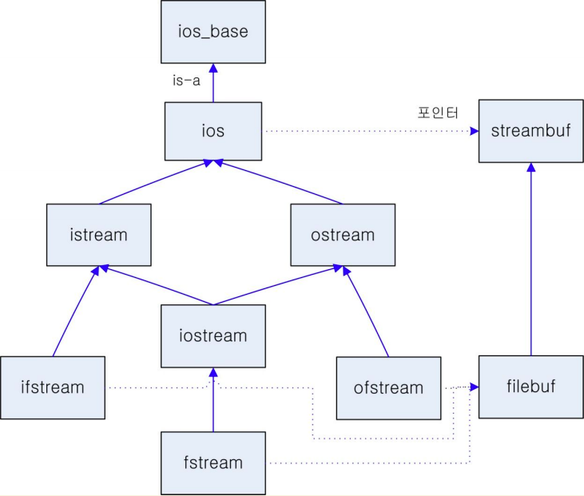

# 키보드 입력 및 콘솔 출력

프로그램 작성 시 키보드로 부터 수, 문자, 문자열과 같은 데이터를 입력을 받는 작업과 프로그램의 결과를 콘솔 화면에 출력하는 작업이 필요하다. 
본 절에서는 키보드로 부터 데이터를 입력받는 기능과 콘솔에 데이터를 출력하는 방법에 대해서 셜명한다.
이전 절에서 "Hello World!" 를 콘솔에 출력하는 프로그램을 통해 데이터를 콘솔 화면에 출력하는 프로그램을 작성하였다.

## 스트림(stream)

스트림이라는 영어 단어는 흐르는 시냇물을 뜻하는 것으로 시냇물에 종이배를 올려두면 순서대로 연속해서 떠내려 간다. 컴퓨터 공학에서 스트림은 연속적인 데이터의 흐름 또는 **데이터의 전송 순서가 변하지 않고** 연속적으로 전송하는 소프트웨어 기능을 뜻한다. 

스트림은 다음 그림과 같이 소프트웨어 프로그램과 하드웨어 장치를 연결하고 바이트 단위로 데이터를 주고 받는다. 스트림은 운영체제에 의해 만들이저는 가상의 연결(시냇물)을 의미하며 소프트웨어 프로그램과 하드웨어 간 데이터 송수신을 하는 중간자 역할을 한다. 

스트림은 내부에 버퍼라는 임시 메모리 공간을 가진다. 중간에 버퍼를 사용하면 송신측에서 전달한 문자를 하나씩 전달하지 않고 묶어서 한번에 전달할 수 있어 전송효율을 높일 수 있으며 문자를 잘못 입력한 경우 수정이 가능하다는 장점이 있다.

그러나 게임과 같이 빠른 반응이 요구되는 프로그램에서는 키보드에서 문자가 입력되는 즉시 문자가 바로 소프트웨어에 전달되어야 하는데 입력 문자를 버퍼를 통해 전달하는 것은 응용에 적합하지 않다.     

C++의 스트림은 입력 스트림과 출력 스트림으로 구성된다. 입력 스트림은 키보드, 네트워크 파일 등 데이터 입력 장치로 부터 입력된 데이터를 순서대로 프로그램에 입력하는 객체이며 출력 스트림은 프로그램에서 출력한 데이터를 프린터, 하드디스크, 콘솔, 네트워크, 파일 등과 같이 하드웨어 장치로 데이터로 전달하는 객체이다. 


  <출처: https:\/\/www3.ntu.edu.sg\/home\/ehchua\/programming\/>


## 입출력 관련 클래스

C++의 입출력 관련 클래스는 다음과 같은 클래스 계층 관계를 가진다. C++의 모든 입출력 클래스는 ``ios_base``클래스를 부모 클래스(기반 클래스)로 가진다. ``ios_base`` 클래스는 모든 입출력 스트림 클래스의 기본 클래스로서 일반화된 클래스로 여러 종류의 데이터를 유지할 수 있다. 이는 템플릿 매개 변수에 따라 달라지지 않는 입력 및 출력 스트림에 공통된 여러 종류의 데이터를 유지한다.



``ios_base`` 클래스의 자식 클래스로 ``ios`` 클래스가 있다. 이 클래스에서 데이터를 입력하거나 출력하기 전에 데이터를 임시로 저장하는 스트림 버퍼(``streambuf``)를 초기화한다.
 
입출력 관련 클래스 는 표준 입출력 클래스와 파일 입출력 클래스로 구분된다. 

| 분류   |  클래스들 |  설명  |
|-----------|-----------|-----------|
| 표준 입출력 클래스 | istream, ostream, iostream | 문자 단위의 입력, 출력, 입출력 스트림 , 키보드 입력, 모니터 출력 |
| 파일 입출력 클래스 | ifstream, ofstream, fstream | 파일 입력, 파일 출력 |

포준 입출력 클래스와 관련 객체, 기능, 관련 하드웨어는 다음과 같다.

| 클래스  |객체 | 기능|
|--------|-----------|--------------|
| istream | cin   | **키보드**로 부터 데이터 **입력** 스트림 객체 |
| ostream | cout  | **모니터**로 데이터 **출력** 스트림 객체 |
| ostream | cerr  | **모니터**로 오류 **츌력** 스트림 객체 (버퍼를 거치지 않고 출력) |
| ostream | clog  | **모니터**로 오류 **출력** 스트림 객체 (버퍼를 거쳐 출력) |


## 데이터를 콘솔 화면에 출력 

스크린(모니터)에 데이터를 출력하기위해 출력 스트림에 데이터를 출력하는 삽입 연산자(insertion operator) 또는 삽입자라 부르는 ```<<```연산자가 사용된다. 

### 삽입 연산자

C++ 입출력 시스템의 ```ostream``` 클래스에는 삽입 연산자인 ```<<``` 를 사용하여 다양한 값을 출력할 수 있다.
다음은 ```ostream``` 클래스에서  ```<<``` 연산자 오버로딩(overloading) 된 코드이다.


```cpp

classs ostream : virtual public ios {
	...
public:
	ostream& operator<< (char c);
	ostream& operator<< (signed char c);
	ostream& operator<< (unsigned char c);
	ostream& operator<< (const char* s);
	ostream& operator<< (const signed char* s);
	ostream& operator<< (const unsigned char* s);
	ostream& operator<< (int n);
	ostream& operator<< (double d);

   ....
};
```

```ostream``` 클래스 내의 ```<<``` 연산자의 반환 자료형(함수를 참조)은 ```ostream``` 클래스 형태이며
반환 자료형은 ```ostream&``` 출력 스트림의 참조가 반환된다. 

### 삽입 연산자의 동작 순서  

다음의 ```<<``` 연산자의 실행 과정은 다음과 같다. 

```cpp
cout << "age: " << 24 << endl;```

 i) ``cout << "age: "``에서 연산자 함수를 호출한다. 매개변수로 전달되는 것은 "age: " 이므로 
 ``ostream operator<< (const char* s)`` 를 호출하고 "age: "를 매개변수로 전달한다. 

 ```cpp
 ostream& operator << (const char* s) {
 	스트림 버퍼에 "age :" 를 저장한다.
 	return *this    // 이 스트림의 참조를 반환한다.
}
```
여기서 ``*this``는 현재 스트림에 대한 참조이다. 현재 스트림이 ``cout``이기 때문에 반환되는 참조도 ``cout``을 가리킨다. 즉 ``cout << "age: "``의 결과는 스트림 버퍼에 값이 저장된 후 cout 이 반환단다.

ii) 그 후 ```cout << 24``` 이 호출된다. 

```cpp
 ostream& operator << (int n) {
 	스트림 버퍼에 n(24) 를 저장한다.
 	return *this    // 이 스트림의 참조를 반환한다.
}
```
```cout << "age: " <<< 24```

실행된  후에는 ```cout``` 스트림이 반환되고 스트림 버퍼에는 ``age: 24`` 가 저장된다. 

iii) 그 후  ```cout << endl``` 이 호출된다. 

스트림 버퍼에 줄바꿈 문자를 저장하고 스크린에 스트림 버퍼의 내용을 출력한다.  


## 키보드로 부터 데이터 입력 

입력스트림 ```istream```의 객체 ```cin```은 키보드와 C++ 응용 프로그램을 연결하는 C++ 표준 입력 스트림 객체(standard input stream object)이다. 키보드로 부터 입력되는 값은 모두 ```cin``` 객체의 스트림 버퍼에 저장되며 응용 프로그램은 ```cin``` 객체의 스트림 버퍼에 저장된 키 값을 읽는다.  

### 추출 연산자

데이터를 키보드로 부터 입력하는 클래스인 ```istream```의 ```cin```과 함께 사용하는 ```>>``` 연산자를 
추출 연산자(extraction operator) 또는 추출자라고 부른다. ```>>``` 연산자는 ```cin``` 으로 부터 키를 입력 받거나 파일에서 데이터를 읽을 때 사용된다. 
C++ 입출력 시스템은 다음과 같이 입력 스트림으로 부터 값을 입력받는 다양한 ```>>``` 연산자를 ```istream``` 클래스에 연산자 오버로딩된다. 

```cpp
classs istream : virtual public ios {
	...
public:
	istream& operator>> (char& c);       //문자를 입력하는 >> 연산자 
	istream& operator>> (signed char& c);
	istream& operator>> (unsigned char& c);
	istream& operator>> (const char* s);
	istream& operator>> (const signed char* s);
	istream& operator>> (const unsigned char* s);
	istream& operator>> (int& n);
	istream& operator>> (double& d);

   ....
};
```
추출 연산자를 이용하여 문자열을 입력받는 경우 공백 문자를 만나면 그 전까지 입력된 문자들을 하나의 문자열로 인식하는 [프로그램](../SampleCodes/InOut/stringIn.cc)) 이다.

```cpp
#include <iostream>
using namespace std;

int main(int argc, char const *argv[])
{
	char arr[20];
	cout << "문자열을 입력하시오:";
	cin >> arr;
	cout << arr << endl;

	return 0;
}
```

### 공백이 포함된 문자열 입력 

공백이 포함된 문자열을 입력받기 위해서는 ```cin```객체의 ```getline()```  멤버함수를 사용한다. 
```getline()```함수의 프로토타입(원형)은 다음과 같다.

```cpp
 cin.getline(char buf[], int size, char delimitChar);
```

* buf: 키보드로부터 읽은 문자열을 저장할 배열 
* size: buf[] 배열의 크기 
* delimitChar: 문자열 입력 끝을 지정하는 구분 문자 

다음은 ```getline``` 멤버 함수를 사용해서 한 줄의 문자열을 입력하는 [프로그램](../SampleCodes/InOut/strline.cc)) 이다.

```cpp
#include <iostream>
using namespace std;

int main(int argc, char const *argv[])
{
	char inbuf[100];

	cout << "문자열을 입력하시오: ";
	cin.getline(inbuf, 100, '\n');

	cout << "length of input string: " << strlen(inbuf) <<endl;
	cout << "input data: " << inbuf << endl;

	return 0;
}
```


